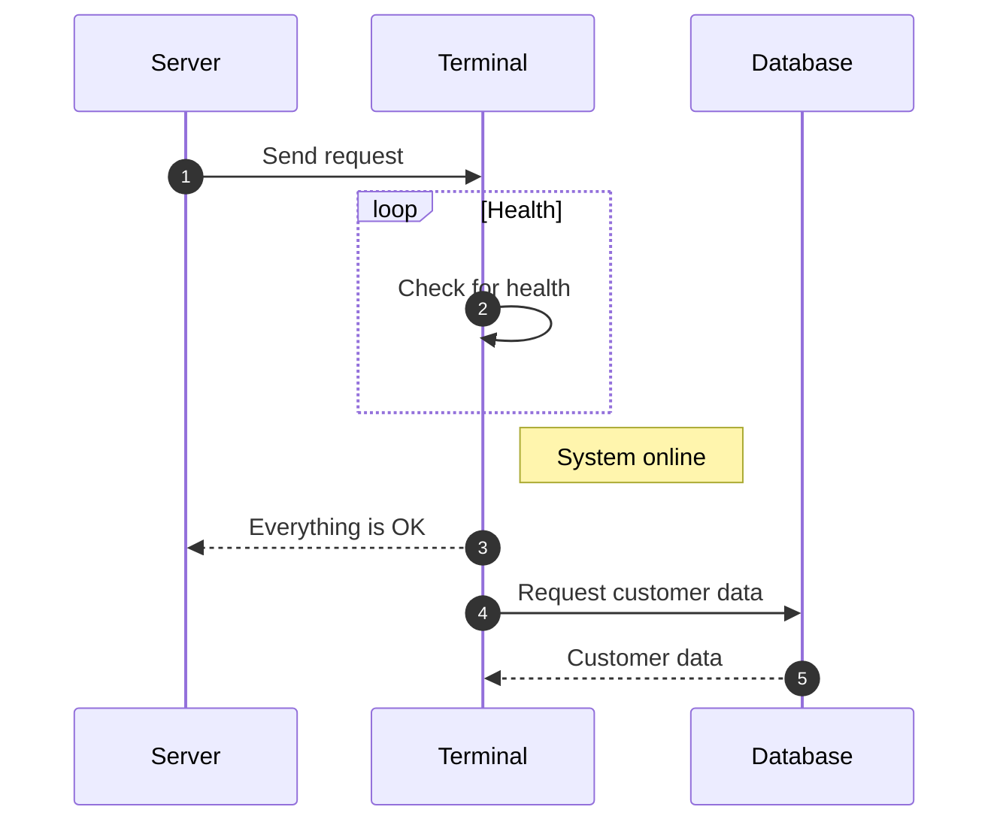

# 如何用 Material for MkDocs 搭建一个属于你的博客

## 运行 Material for MkDocs

### 首先创建一个项目


### clone 你的仓库

```bash
git clone git@github.com:Mighty599/mkdocs-material.git
```

### 进入文件夹

```bash
cd mkdocs-material
```

### 在你的项目中创建一个**虚拟环境**

虚拟环境是一个隔离的 Python 环境，允许你在项目内独立安装特定版本的 Python 包，而不会影响系统全局的 Python 环境或其他项目。在这个环境中，你可以安 MkDocs Material 以及其他依赖，不会影响系统中的全局设置和其他项目。

```bash
python -m venv venv
```

### 激活虚拟环境

`source venv/scripts/activate` 命令的作用是激活虚拟环境，使得当前终端会话进入虚拟环境，以便使用其中的 Python 解释器和依赖包。

```bash
source venv/scripts/activate
```

### 检查你的 python 包管理工具是否安装

```bash
pip --version
```

### 安装 mkdocs-material

```bash
pip install mkdocs-material
```

### 创建一个站点文件

```bash
mkdocs new .
```

新写入了 index.md 和 mkdocs.yml

```json
|-- LICENSE
|-- README.md
|-- docs
|   `-- index.md
|-- mkdocs.yml
`-- venv
    |-- Include
    |-- Lib
    |-- Scripts
    `-- pyvenv.cfg
```

### mkdocs.yml 中添加上基本配置

在 mkdocs.yml 中添加以下配置

```yaml
site_name: My MkDocs Material Documentation
site_url: https://sitename.example
theme:
  name: material
```

### 启动网站

```bash
mkdocs serve
```

网站部署在[http://localhost:8000](http://localhost:8000/)

---

## 配置你的博客网站

```yaml title="mkdocs.yml"
site_name: My Blog - Tenax

theme:
  name: material
  font:
    text: Inter
    code: Roboto Mono
  logo: assets/logo.png
  favicon: assets/favicon.ico
  features:
    - navigation.top
    - navigation.tabs
    - navigation.sections
    - navigation.footer
    - toc.integrate
    - search.suggest
    - search.highlight
    - content.tabs.link
    - content.code.annotate
    - content.code.copy

  language: zh

  palette:
    #Light Mode
    - scheme: default
      toggle:
        icon: material/lightbulb-outline
        name: Switch to dark mode
      primary: green
      accent: green

    #Dark Mode
    - scheme: slate
      toggle:
        icon: material/lightbulb
        name: Switch to light mode
      primary: black
      accent: deep purple

nav:
  - Blog:
      - blog/posts/Material for MkDocs的运行、配置和部署.md

extra:
  social:
    - icon: fontawesome/brands/gitlab
      link: http://gitlab.code-nav.cn/Tenax

copyright: Copyright &copy; 2024 <a href="http://gitlab.code-nav.cn/Tenax"  target="_blank" rel="noopener">Tenax</a>
```

### 站点名称与主题配置

- **site_name**：网站名称设置为 "My Blog - Tenax"。

- **theme**:

      - **名字**：`material` 。

      - **字体**：文本使用 `Inter`字体，代码使用 `Roboto Mono`字体。

      - **图标**：`assets/logo.png` 作为网站 Logo，`assets/favicon.ico` 作为网站图标。

      - **主题特色**：

        **`navigation.top`**
        启用 **顶部导航**，即导航栏会固定在页面顶部。当你滚动页面时，导航栏将保持在屏幕顶部，便于快速跳转到其他页面。

        **`navigation.tabs`**
        启用 **标签式导航**，允许在同一页面中使用多个标签（Tab）来组织内容。例如，在展示代码块或长内容时，可以使用标签区分不同的部分。

        **`navigation.sections`**
        启用 **分区导航**，在页面侧边栏显示该页面的章节目录。这有助于用户快速导航到页面中的特定部分，尤其是长篇文章。

        **`navigation.footer`**
        启用 **页脚导航**，在页面底部显示链接或其他信息。常用于提供版权信息、联系链接或额外的导航选项。

        **`toc.integrate`**
        启用 **目录集成**，使得文章中的目录（Table of Contents, TOC）会自动生成，并且可以在页面侧边栏或页面顶部显示，帮助用户更容易地浏览长文章。

        **`search.suggest`**
        启用 **搜索建议**，在用户输入搜索关键词时，自动显示相关的搜索建议，帮助用户更快速地找到相关内容。

        **`search.highlight`**
        启用 **搜索高亮**，在搜索结果中高亮显示匹配的关键词，用户可以更直观地看到搜索结果中的重点内容。

        **`content.tabs.link`**
        启用 **内容标签链接**，为页面中的每个标签提供链接，使得用户能够直接通过链接跳转到页面的特定标签内容。

        **`content.code.annotate`**
        启用 **代码注释**，在代码块中提供额外的注释功能，使得代码示例更易于理解。通常可以通过 `py`、`js` 等语言标记代码并为其添加注释。

        **`content.code.copy`**
        启用 **代码复制功能**，用户可以一键复制代码块中的内容。这对分享代码非常方便，提升用户体验。

  - **调色板**：提供了两种配色方案（浅色和深色模式），主色为绿色（浅色模式）和黑色（深色模式）。

#### 设置中文

- **language**:

  - 在 MkDocs 中，`language` 配置项用于定义整个站点的语言环境。设置为 `zh` 表示以下几点：

    **界面语言**：

    - 所有的界面文本（如搜索框提示、分页、导航菜单等）都会自动转换为中文。这意味着，如果使用的主题支持多语言切换，界面将显示为中文。

    **日期和时间格式**：

    - 日期相关的内容，如博客文章的发布日期，可能会采用中文格式。例如，日期显示格式会变成“2024 年 11 月 14 日”而不是“November 14, 2024”。

    **本地化支持**：

    - 一些主题和插件在 `language` 设置为 `zh` 时，会根据中文习惯调整显示格式和内容。这包括使用中文字符的搜索提示、文章目录、页面标题等。

#### 导航菜单

- **nav**：网站的主导航栏包含一个名为 `Blog` 的菜单项，指向博客文章 `Material for MkDocs的运行、配置和部署.md`。

#### **额外设置**

- **extra**：社交链接：添加了一个 GitLab 链接，图标使用 FontAwesome 图标。

#### 版权信息

- 页面底部显示版权信息，链接指向 GitLab 项目。

??? tip "提示"

    1 . 更多字体样式请查看[谷歌字体](https://fonts.google.com/)

    2 . 更多设置，比如按时间来自动调整深色模式还是浅色模式，设置后退和前进箭头等更多细节请查看Material for Mkdocs的[官方文档](https://squidfunk.github.io/mkdocs-material/)

    3 . 更多疑问请结合Mkdocs[官方文档](https://mkdocs.readthedocs.io/)

    4 . 网站LOGO和网站图标我分别使用[Favicon](https://favicon.io/)和[Realfavicongenerator](https://realfavicongenerator.net/)两个网站

---

### 代码块配置

```yaml title="mkdocs.yml"
markdown_extensions:
  - pymdownx.emoji:
      emoji_index: !!python/name:material.extensions.emoji.twemoji
      emoji_generator: !!python/name:material.extensions.emoji.to_svg

  - pymdownx.highlight:
      anchor_linenums: true
      line_spans: __span
      pygments_lang_class: true

  - pymdownx.inlinehilite
  - pymdownx.snippets

  - pymdownx.arithmatex:
      generic: true

  - footnotes

  - pymdownx.superfences:
      custom_fences:
        - name: mermaid
          class: mermaid
          format: !!python/name:pymdownx.superfences.fence_code_format

  - pymdownx.tabbed:
      alternate_style: true

  - admonition
  - pymdownx.details
  - pymdownx.mark
  - attr_list
```

### `pymdownx.highlight`

- **配置内容**:

  ```yaml
  markdown_extensions:
    - pymdownx.highlight:
        anchor_linenums: true
        line_spans: __span
        pygments_lang_class: true
    - pymdownx.snippets
    - pymdownx.superfences
  ```

- **作用**: 提供代码高亮功能，支持多语言语法高亮，还可以：

      - **显示行号**（`linenums`）。
      - **高亮特定行**（`hl_lines`）。
      - **支持自定义标题**（`title`）。

- **渲染分析**:

      - 示例中的 `code-examples` 和语言标记 `js` 的代码块都会被正确渲染，使用的是 `Pygments` 的语法高亮方案。
      - 行号（`linenums="1"`）、高亮行（`hl_lines="2-4"`）、和标题（`title="code-examples"`）的功能都会生效。

````js title="code-examples.md"
```js title="code-examples" linenums="1" hl_lines="2-4"

function concatenateStrings(str1, str2) {
  return str1 + str2;
}

const result = concatenateStrings("Hello, ", "World!");
console.log("The concatenated string is:", result);
```;
````

<div class="result" markdown>

```js title="code-examples" linenums="1" hl_lines="2-4"
function concatenateStrings(str1, str2) {
  return str1 + str2;
}

const result = concatenateStrings("Hello, ", "World!");
console.log("The concatenated string is:", result);
```

</div>

### `pymdownx.superfences`

- **配置内容**:

  ```yaml
  - pymdownx.superfences:
      custom_fences:
        - name: mermaid
          class: mermaid
          format: !!python/name:pymdownx.superfences.fence_code_format
  ```

- **作用**: 增强代码块的功能，包括支持：

  - 嵌套式代码块。
  - 自定义代码块类型（如 `mermaid` 图表）。
  - 兼容标准 Markdown 的代码块。

- **渲染分析**: 示例中的代码块会利用 SuperFences 自动解析并适配标题、行号等功能，`mermaid` 的代码块（如果存在）会被转换为图表。

````title="code-examples.md"

````

<div class="result" markdown>


</div>

### `pymdownx.inlinehilite`

- **配置内容**:

  ```yaml
  - pymdownx.inlinehilite
  ```

- **作用**: 提供内联代码高亮，允许像 `Some code` 这样的短代码片段被正确高亮。

- **渲染分析**:

  - 示例中的 `Some 'code' goes here.` 会被正确渲染为内联代码。

````title="code-examples.md"
```
Some `code` goes here.
```
````

<div class="result" markdown>

```md title="code_examples.md"
Some `code` goes here.
```

</div>

### `pymdownx.emoji`

- **配置内容**:

  ```yaml
  - pymdownx.emoji:
      emoji_index: !!python/name:material.extensions.emoji.twemoji
      emoji_generator: !!python/name:material.extensions.emoji.to_svg
  ```

- **作用**: 渲染表情符号为 SVG 图片或标准 Unicode 字符。支持：

  - 使用标准的表情符号（如 `:smile:`）。
  - FontAwesome 和 Octicons 的图标（如 `:fontawesome-regular-face-laugh-wink:`）。

### 其他扩展

#### **Admonition**

- 支持 `???` 语法来创建提示框（如 `??? note "Title"`）。

#### **pymdownx.details**

- 支持创建折叠/展开的详情框。

#### **pymdownx.mark**

- 支持 `==highlighting==` 文字高亮。

#### **attr_list**

- 支持为 Markdown 元素附加 CSS 类（如 `.twitter` 或 `.heart`）。

如果您想添加其他语言的代码，请在此[pygments](https://pygments.org/docs/lexers/#lexers-for-javascript-and-related-languages)页面上找到词法分析器（该语言的简称）。例如：

- [:simple-typescript: Typescript](https://pygments.org/docs/lexers/#pygments.lexers.javascript.TypeScriptLexer)
- [:fontawesome-brands-java: Java](https://pygments.org/docs/lexers/#pygments-lexers-for-jvm-languages)
- [:fontawesome-brands-golang: GoLang](https://pygments.org/docs/lexers/#lexers-for-the-google-go-language)

??? tip "提示"

    更多问题请查看 Material for Mkdocs 的[官方文档](https://squidfunk.github.io/mkdocs-material/)

---

## 部署你的 Material for Mkdocs

新创建一个.github 文件夹，再在里面创建一个 workflow 文件夹，最后在 workflow 文件夹里面创建一个 ci.yml 文件

```bash
|-- .git
|-- .github
|   `-- workflows
|       `-- ci.yml
|-- .gitignore
|-- LICENSE
|-- README.md
|-- docs
|   |-- index.md
|   `-- page2.md
|-- mkdocs.yml
`-- venv
    |-- Include
    |-- Lib
    |-- Scripts
    `-- pyvenv.cfg
```

```yaml title="ci.yml"
name: ci
on:
  push:
    branches:
      - master
      - main
permissions:
  contents: write
jobs:
  deploy:
    runs-on: ubuntu-latest
    steps:
      - uses: actions/checkout@v4
      - name: Configure Git Credentials
        run: |
          git config user.name github-actions[bot]
          git config user.email 41898282+github-actions[bot]@users.noreply.github.com
      - uses: actions/setup-python@v5
        with:
          python-version: 3.x
      - run: echo "cache_id=$(date --utc '+%V')" >> $GITHUB_ENV
      - uses: actions/cache@v4
        with:
          key: mkdocs-material-${{ env.cache_id }}
          path: .cache
          restore-keys: |
            mkdocs-material-
      - run: pip install mkdocs-material
      - run: mkdocs gh-deploy --force
```

该 `ci.yml` 文件是一个 GitHub Actions 配置文件，用于在 GitHub 上设置持续集成（CI）流程。这个工作流主要执行 MkDocs 的部署到 GitHub Pages 的操作。下面是对文件各个部分的分析：

### **name: ci**

该字段指定了工作流的名称，`ci` 表示持续集成流程。

### **on: push**

该部分定义了何时触发工作流：

- 当 `master` 或 `main` 分支上有代码推送时，触发该工作流。这意味着每次向这两个分支之一推送代码时，CI 流程会运行。

```yaml
push:
  branches:
    - master
    - main
```

### **permissions: contents: write**

该部分指定了工作流所需的权限：

- `contents: write`：允许工作流修改 GitHub 仓库的内容（比如修改文件或推送更新）。

```yaml
permissions:
  contents: write
```

### **jobs: deploy**

该部分定义了 CI 工作流的任务。任务名为 `deploy`，表示部署任务。

```yaml
jobs:
  deploy:
    runs-on: ubuntu-latest
```

- **runs-on: ubuntu-latest**: 这表示该任务将在最新版本的 Ubuntu 环境中运行。

### **steps**

步骤部分定义了具体的执行步骤，每个步骤都有一个执行的操作。

```yaml
steps:
  - uses: actions/checkout@v4
```

**`actions/checkout@v4`**：

- 这一步用于检查出当前 GitHub 仓库的代码，确保工作流可以在最新的代码上运行。

```yaml
- name: Configure Git Credentials
  run: |
    git config user.name github-actions[bot]
    git config user.email 41898282+github-actions[bot]@users.noreply.github.com
```

**配置 Git 用户名和邮箱**：

- 该步骤通过 Git 命令配置 GitHub Actions 机器人账号的用户名和邮箱，这对于自动提交变更时是必要的。

```yaml
- uses: actions/setup-python@v5
  with:
    python-version: 3.x
```

**`actions/setup-python@v5`**：

- 该步骤使用 GitHub Actions 的官方 Python 设置工具来安装 Python 环境，确保 Python 环境已经设置并准备好运行后续操作。指定了 `3.x` 版本，意味着会使用最新的 Python 3 版本。

```yaml
- run: echo "cache_id=$(date --utc '+%V')" >> $GITHUB_ENV
```

**设置缓存 ID**：

- 使用 `date` 命令创建一个缓存 ID，基于当前的周数（`%V`）。然后，将 `cache_id` 写入到 GitHub 环境变量中。这是为了确保缓存的键是基于每周变化的，避免在不同周之间使用相同的缓存。

```yaml
- uses: actions/cache@v4
  with:
    key: mkdocs-material-${{ env.cache_id }}
    path: .cache
    restore-keys: |
      mkdocs-material-
```

**使用缓存**：

- 该步骤通过 `actions/cache` 插件来缓存 `.cache` 目录，以加速后续运行。
- `key` 设置为 `mkdocs-material-${{ env.cache_id }}`，这意味着每周的缓存都会不同。
- `restore-keys` 指定了一个前缀，当没有完全匹配的缓存时，GitHub 会尝试使用这个前缀查找缓存。

```yaml
- run: pip install mkdocs-material
```

**安装 MkDocs Material**：

- 该步骤使用 `pip` 安装 `mkdocs-material`，这是一个用于创建静态博客和文档的主题，基于 MkDocs。

```yaml
- run: mkdocs gh-deploy --force
```

**部署到 GitHub Pages**：

- 使用 `mkdocs gh-deploy` 命令将 MkDocs 生成的静态网站部署到 GitHub Pages。
- `--force` 参数表示强制执行，即使 GitHub Pages 上已经存在一些旧的内容，仍然会覆盖它们。

```bash
git add .
```

```bash
git commit -m $'Adding initial documentation files'
```

```bash
git push origin main
```


---

## 补充

在 vscode 中安装[`vscode- yaml`](https://marketplace.visualstudio.com/items?itemName=redhat.vscode-yaml) 提供 YAML 语言支持。

```json
  "redhat.telemetry.enabled": true,
  "yaml.schemas": {
    "https://squidfunk.github.io/mkdocs-material/schema.json": "mkdocs.yml"
  },
  "yaml.customTags": [
    "!ENV scalar",
    "!ENV sequence",
    "!relative scalar",
    "tag:yaml.org,2002:python/name:material.extensions.emoji.to_svg",
    "tag:yaml.org,2002:python/name:material.extensions.emoji.twemoji",
    "tag:yaml.org,2002:python/name:pymdownx.superfences.fence_code_format"
  ]
```

把 settings.json 中的`"redhat.telemetry.enabled":`选项改为 ture，并将`"yaml.schemas"`和`"yaml.customTags"`选项改为（或补充）以上代码


在 mkdocs.yml 文件中，当我们将鼠标悬停在配置文件中的 Mkdocs 的选项上，会有相关的 Mkdocs 提示

---

**参考：**

[How To Create STUNNING Code Documentation With MkDocs Material Theme](https://www.youtube.com/watch?v=Q-YA_dA8C20)

[Material for Mkdocs:Full Tutorial To Build And Deploy Your Docs Portal](https://www.youtube.com/watch?v=xlABhbnNrfI)

[Getting Started with Material for Mkdocs](https://jameswillett.dev/getting-started-with-material-for-mkdocs/)

[jameswillett.dev](https://github.com/james-willett/jameswillett.dev)
