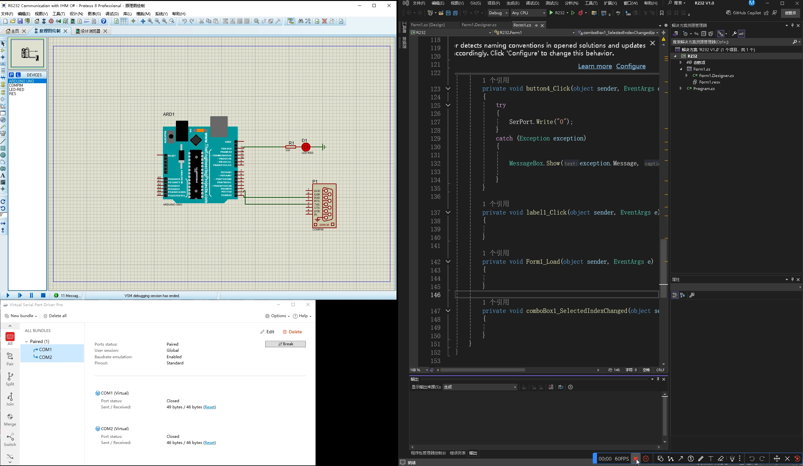

---
date:
  created: 2024-01-12
tags:
  - Arduino
authors: [Tenax]
description: >
  Learn how to use UART / RS232 to communicate with Arduino via GUI Winforms C# on the simulator Proteus. 
---

# 学习通过图形用户界面 Winforms C#在模拟器Proteus上运用UART / RS232与Arduino通信 

<!-- more -->

{ width="1000" }

使用[PlatformIO IDE](https://marketplace.visualstudio.com/items?itemName=platformio.platformio-ide)插件初始化文件与Proteus

{ width="1000" }

编译文件，成功之后将，例如我`C:\Users\Administrator\Documents\PlatformIO\Projects\RS232 Communication\.pio\build\uno`下的firmware.hex文件载入到Proteus中的arduino单片机中

{ width="1000" }

将引脚按上图连接好

```c
#include <Arduino.h>

const int LedPin = 13;
int ledState = 0;

void setup()
{
  // put your setup code here, to run once:

  pinMode(LedPin, OUTPUT);
  Serial.begin(9600);
}

void loop()
{
  // put your main code here, to run repeatedly:

  char receiveVal;

  if (Serial.available() > 0)
  {
    receiveVal = Serial.read();

    if (receiveVal == '1')
    {
      ledState = 1;
      Serial.write('1');
    }
    else
    {
      ledState = 0;
      Serial.write('0');
    }
  }

  digitalWrite(LedPin, ledState);

  delay(50);
}

// put function definitions here:
```

```c#
using System.IO.Ports;

namespace R232
{
    public partial class Form1 : Form
    {
        private SerialPort SerPort;
        private string ReceivedData;
        public Form1()
        {
            InitializeComponent();

            FetchAvailablePorts();

            button1.Enabled = true;
            button2.Enabled = false;
        }

        void FetchAvailablePorts()
        {
            String[] ports = SerialPort.GetPortNames();
            comboBox1.Items.AddRange(ports);
        }

        private void button1_Click(object sender, EventArgs e)
        {
            //Serial port configuration

            if (label1.Text == "Disconnected !")
            {
                SerialPort SerPort = new SerialPort();
                SerPort.PortName = comboBox1.Text;  // 选择串口
                SerPort.BaudRate = 9600;            // 设置波特率
                SerPort.Parity = Parity.None;       // 设置校验位
                SerPort.DataBits = 8;               // 设置数据位
                SerPort.StopBits = StopBits.One;    // 设置停止位
                SerPort.ReadBufferSize = 20000000;
                SerPort.DataReceived += SerPort_DataReceived;

                try
                {
                    SerPort.Open(); //打开串口
                    Thread.Sleep(1000); //等待一秒

                    if (SerPort.IsOpen)
                    {
                        button1.Enabled = false;
                        button2.Enabled = true;

                        label1.ForeColor = Color.Green;
                        label1.Text = "Connected !";
                    }
                    else
                    {
                        button1.Enabled = true;
                        button2.Enabled = false;

                        label1.ForeColor = Color.Red;
                        label1.Text = "Disconnected !";
                    }
                }
                catch (Exception exception)
                {
                    MessageBox.Show(exception.Message, "Error!");
                }
            }
        }

        private void button2_Click(object sender, EventArgs e)
        {
            if (label1.Text == "Connected !")
            {
                if (SerPort.IsOpen)//验证是否打开
                {
                    SerPort.Close();

                    Thread.Sleep(1000);//等待一秒

                    button1.Enabled = true;
                    button2.Enabled = false;

                    label1.ForeColor = Color.Red;
                    label1.Text = "Disconnected !";
                }
            }
        }

        private void SerPort_DataReceived(object sender, SerialDataReceivedEventArgs e)
        {
            ReceivedData = SerPort.ReadExisting();//读取序列化串口
            this.Invoke(new EventHandler(ProcessingDate));
        }

        private void ProcessingDate(object sender, EventArgs e)
        {
            if (ReceivedData == "1")
            {
                textBox1.ForeColor = Color.Red;
                textBox1.Text = "LED ON";
            }
            else
            {
                textBox1.ForeColor = Color.Black;
                textBox1.Text = "LED OFF";
            }

        }

        private void button3_Click(object sender, EventArgs e)
        {
            try
            {
                SerPort.Write("1");
            }
            catch (Exception exception)
            {

                MessageBox.Show(exception.Message, "Error!");

            }
        }

        private void button4_Click(object sender, EventArgs e)
        {
            try
            {
                SerPort.Write("0");
            }
            catch (Exception exception)
            {

                MessageBox.Show(exception.Message, "Error!");

            }
        }

        private void label1_Click(object sender, EventArgs e)
        {

        }

        private void Form1_Load(object sender, EventArgs e)
        {
            
        }

        private void comboBox1_SelectedIndexChanged(object sender, EventArgs e)
        {

        }
    }
}

```

**C# 端的串口操作：**
在 C# 中，我通过 `System.IO.Ports.SerialPort` 类来进行串口通信。这个类本质上是对 UART 的封装，使得我可以在 C# 中通过 UART 协议进行数据发送和接收。C# 中的 `SerialPort` 类并没有明确地标明“UART”，但它实际上是操作 UART 的。

```c#
SerialPort SerPort = new SerialPort();
SerPort.PortName = comboBox1.Text;  // 选择串口
SerPort.BaudRate = 9600;            // 设置波特率
SerPort.Parity = Parity.None;       // 设置校验位
SerPort.DataBits = 8;               // 设置数据位
SerPort.StopBits = StopBits.One;    // 设置停止位
SerPort.Open();                     // 打开串口
```

这些配置是典型的 UART 设置：波特率、数据位、停止位、校验位等参数，都是 UART 协议的重要特征。

??? info "异步串行通信"

    { align=left }（此图中，发送了2个字节，每个包含了开始比特、随后8个数据比特，以及一个停止比特，总计每帧10个比特。也可以有一个奇偶校验比特。）
    
     异步串行通信是一种串行通信，其通信的端点不是被共同的时钟信号持续对齐。在每个数据单元传输时，数据流自带同步信息（开始信号与停止信号）。
     
     RS-232传输ASCII字节时，就常采用这种方式。
     
     使用异步串行通信，发送方与接收方必须就下述问题达成协议：
     
     1.全双工还是半双工
     
     2.每个字符的比特数
     
     3.比特序：哪个比特先发送
     
     4.线路的每秒比特速率。有些系统能自动检测速率
     
     5.是否使用奇偶校验位
     
     6.如果使用，是奇校验还是偶校验
     
     7.停止比特的最低数量
     
     异步串行通信的开始/停止比特在物理层用于计算机与调制解调器的通信，数据链路使用帧协议如PPP。相比于同步访问的性能损失可以忽略。

**Arduino 端的串口操作：**
Arduino 代码中使用的是 `Serial` 对象来进行 UART 通信：

```c
Serial.begin(9600);    // 初始化串口，设置波特率为 9600
if (Serial.available() > 0) {  // 检查是否有数据到达
    char receiveVal = Serial.read();  // 读取数据
}
```

Arduino 的 `Serial` 库也是通过 UART 协议实现的，通常使用的是硬件串口（`Serial`）或者软串口（`SoftwareSerial`）来进行数据传输。

??? info "UART"

    **通用异步收发传输器**（Universal Asynchronous Receiver/Transmitter，通常称为**UART**）是一种[异步收发传输器](https://zh.wikipedia.org/wiki/异步串行通信)，是[电脑硬件](https://zh.wikipedia.org/wiki/电脑硬件)的一部分，将数据通过[串列通信](https://zh.wikipedia.org/wiki/串列通訊)进行传输。
    
     UART是通用异步收发器（异步串行通信口）的英文缩写，它包括了[RS232](https://zh.wikipedia.org/wiki/RS232)、[RS449](https://zh.wikipedia.org/w/index.php?title=RS449&action=edit&redlink=1)、[RS423](https://zh.wikipedia.org/w/index.php?title=RS423&action=edit&redlink=1)、[RS422](https://zh.wikipedia.org/wiki/RS422)和[RS485](https://zh.wikipedia.org/wiki/RS485)等接口标准规范和总线标准规范，即UART是异步串行通信口的总称。而RS232、RS449、RS423、RS422和RS485等，是对应各种异步串行通信口的接口标准和总线标准，它规定了通信口的电气特性、传输速率、连接特性和接口的机械特性等内容。实际上是属于通信网络中的[物理层](https://zh.wikipedia.org/wiki/物理层)（Physical Layer）的概念，与通信协议没有直接关系。而通信协议，是属于通信网络中的[数据链路层](https://zh.wikipedia.org/wiki/数据链路层)（Data Link Layer）的概念。

**RS-232**

**RS-232**是美国[电子工业联盟](https://zh.wikipedia.org/wiki/电子工业联盟)（EIA）制定的串行数据通信的接口标准，原始编号全稱是**EIA-RS-232**（简称232，RS232）。它广泛用于计算机[串行接口](https://zh.wikipedia.org/wiki/串行接口)外设连接。

在RS-232标准中，字符是以一串行的位串来一个接一个的[串列](https://zh.wikipedia.org/wiki/串列)（serial）方式传输，优点是传输线少，配线简单，发送距离可以较远。最常用的编码格式是异步起停（asynchronous start-stop）格式，它使用一个起始比特后面紧跟7或8个数据比特（bit），然后是可选的奇偶校验比特，最后是一或两个停止比特。所以发送一个字符至少需要10比特，带来的一个好的效果是使全部的传输速率，发送信号的速率以10划分。一个最平常的代替异步起停方式的是使用[高级数据链路控制](https://zh.wikipedia.org/wiki/高级数据链路控制)协议（HDLC）。

??? info "RS232连接器"

    { width="300" align=right }
    
    RS-232设计之初是用来连接调制解调器做传输之用，也因此它的脚位意义通常也和调制解调器传输有关。RS-232的设备可以分为数据终端设备（DTE，Data Terminal Equipment, For example, PC）和数据通信设备（DCE，Data Communication Equipment）两类，这种分类定义了不同的线路用来发送和接受信号。一般来说，计算机和终端设备有DTE连接器，调制解调器和打印机有DCE连接器。但是这么说并不是总是严格正确的，用配线分接器测试连接，或者用试误法来判断电缆是否工作，常常需要参考相关的文件说明。
    
    RS-232指定了20个不同的信号连接，由25个D-sub（微型D类）管脚构成的DB-25连接器。很多设备只是用了其中的一小部分管脚，出于节省资金和空间的考虑，不少机器采用较小的连接器，特别是9管脚的D-sub或者是DB-9型连接器被广泛使用绝大多数自IBM的AT机之后的PC机和其他许多设备上。DB-25和DB-9型的连接器在大部分设备上是雌型，但不是所有的都是这样。最近，8管脚的RJ-45型连接器变得越来越普遍，尽管它的管脚分配相差很大。EIA/TIA 561标准规定了一种管脚分配的方法，但是由Dave Yost发明的被广泛使用在Unix计算机上的Yost串连设备配线标准（"Yost Serial Device Wiring Standard"）以及其他很多设备都没有采用上述任一种连线标准。

下表中列出的是被较多使用的RS-232中的信号和管脚分配：

```
           DB-9 Male（Pin Side）                   DB-9 Female （Pin Side）
             -------------                          -------------
             \ 1 2 3 4 5 /                          \ 5 4 3 2 1 /
              \ 6 7 8 9 /                            \ 9 8 7 6 /
               ---------                              ---------
```

|        信号         | DB-25 | DB-9 | EIA/TIA 561 | Yost |
| :-----------------: | :---: | :--: | :---------: | :--: |
|      公共接地       |   7   |  5   |      4      | 4,5  |
| 发送数据（TD、TXD） |   2   |  3   |      6      |  3   |
| 接受数据（RD、RXD） |   3   |  2   |      5      |  6   |
| 数据终端准备（DTR） |  20   |  4   |      3      |  2   |
|  数据准备好（DSR）  |   6   |  6   |      1      |  7   |
|   请求发送（RTS）   |   4   |  7   |      8      |  1   |
|   清除发送（CTS）   |   5   |  8   |      7      |  8   |
| 数据载波检测（DCD） |   8   |  1   |      2      |  7   |
|   振铃指示（RI）    |  22   |  9   |      1      |  －  |

在本次示例中我们用到了DB-9型连接器

成果展示



***

**参考：**

[UART / RS232 Communication Arduino with GUI Winforms C#](https://www.youtube.com/watch?v=RSayGnJz5FM)

[UART](https://zh.wikipedia.org/wiki/UART)

[异步串行通信](https://zh.wikipedia.org/wiki/%E5%BC%82%E6%AD%A5%E4%B8%B2%E8%A1%8C%E9%80%9A%E4%BF%A1)

[RS232](https://zh.wikipedia.org/wiki/RS-232)
