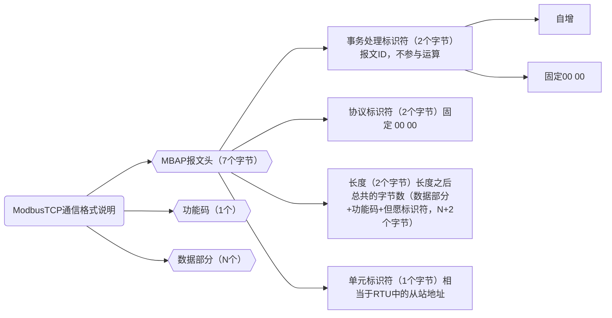
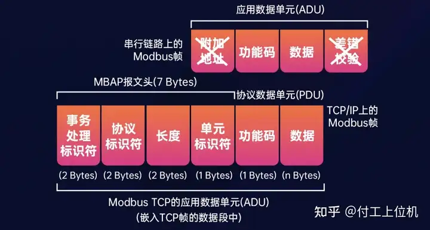

# 学习 ModbusTCP 通信

<!-- more -->

## ModbusTCP 通信报文分析

## ModbusTCP 与 ModbusRTU 的区别

我们可以看出，ModbusTCP 在 Modbus 串行通信的基础上，去除了差错校验和附加地址（即从站地址），然后加上 MBAP 报文头（7 Bytes）。

1. ModbusTCP 协议一般用 于 TCP 或 UDP 通信，而 TCP 和 UDP 本身就具备数据校验，因此不需要再加校验了。

2、ModbusTCP 主要用于以太网通信，因此，不再需要通过附加地址（即从站地址） 来区分不同的设备，因为以太网设备一般会使用 IP 地址来区分。

因此，我们只需要了解 MBAP 报文头即可，因为功能码和数据部分与 ModbusRTU 协议是一样的，下面主要针对 MBAP 报文头进行分析说明。

| 域             | 长度     | 描述                                     | 客户机     | 服务器     |
| -------------- | -------- | ---------------------------------------- | ---------- | ---------- |
| 事务处理标识符 | 2 个字节 | Modbus 请求/响应的识别码                 | 客户机启动 | 复位响应   |
| 协议标识符     | 2 个字节 | 0=Modbus 协议                            | 客户机启动 | 复位响应   |
| 长度           | 2 个字节 | 后续字节的数量                           | 客户机启动 | 服务器启动 |
| 单元标识符     | 1 个字节 | 串行链路或其它总线上连接的远程从站识别码 | 客户机启动 | 复位响应   |

- 事务处理标识符：事务处理标识符可以理解为报文的编号，服务器会复制客户端 的事务处理标识符进行响应，因此事务处理标识符并没有实际意义，一般情况下我们会使用 ID 自增的方式，事务处理标识符占用 2 个字节长度。

- 协议标识符：协议标识符设计时是为了区分不同的协议，但是在实际应用中，只有一个协议 Modbus 协议，用 0 来表示，协议标识符占用 2 个字节长度，所以协议标识符是固定值 0x00 0x00。

- 长度：长度表示它后面有多少个字节，即单元标识符、功能码、数据这三个部分 的字节个数，长度占用 2 个字节长度。

- 单元标识符：单元标识符与从站地址是相似的，因为 ModbusTCP 去除了从站地址， 所以在 MBAP 报文头中加入单元标识符，防止有些场合需要通过一个标识来区别不同的子设备，比如一个串口服务器下挂了多个串口设备，那么就需要单元标识符来区别不同的串口设备，实际应用中单元标识符的值由服务器决定。

- 综合来看，ModbusTCP 协议的通用报文格式如下所示：

| 事务处理标识符 | 协议标识符 | 长度    | 单元标识符 | 功能码  | 数据    |
| -------------- | ---------- | ------- | ---------- | ------- | ------- |
| 2 bytes        | 2 bytes    | 2 bytes | 1bytes     | 1 bytes | N bytes |

事务处理标识符 协议标识符 长度 单元标识符 功能码 数据
2 bytes 2 bytes 2 bytes 1 byte 1 byte N bytes

---

**_参考：_**

[ModbusTCP 通信协议分析](https://www.cnblogs.com/xiketangedu/p/18442108)
