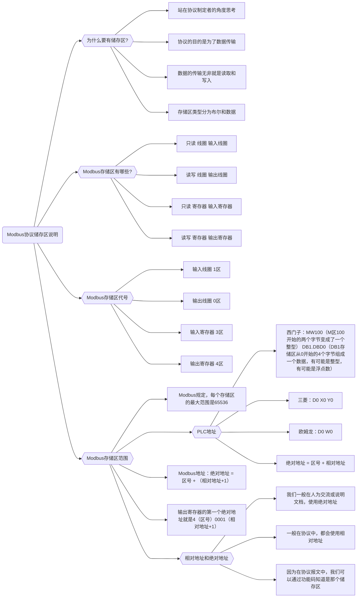
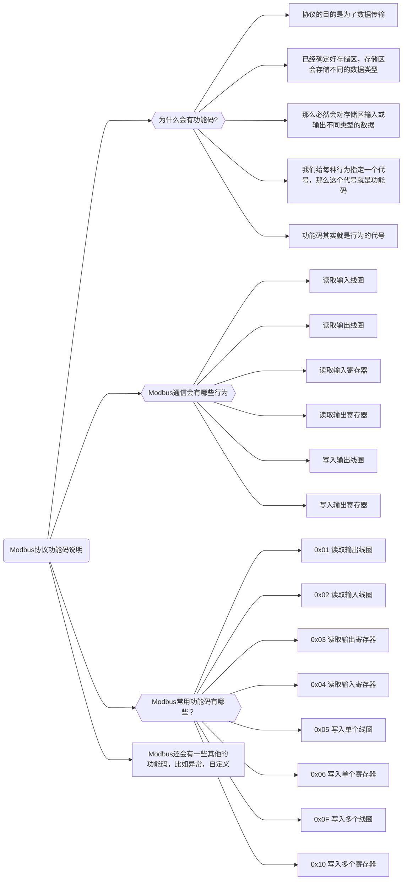
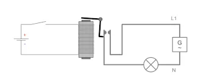
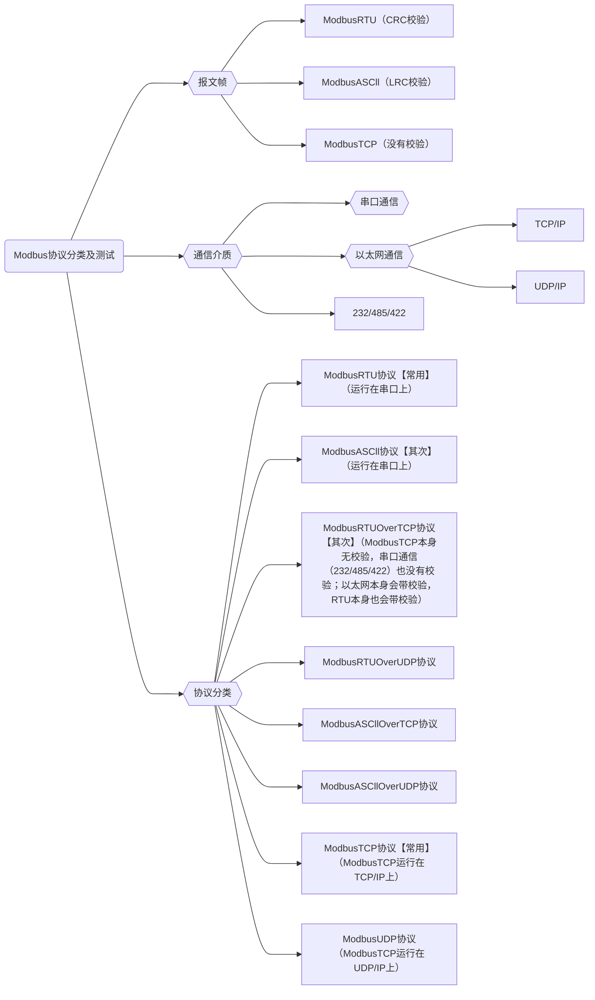
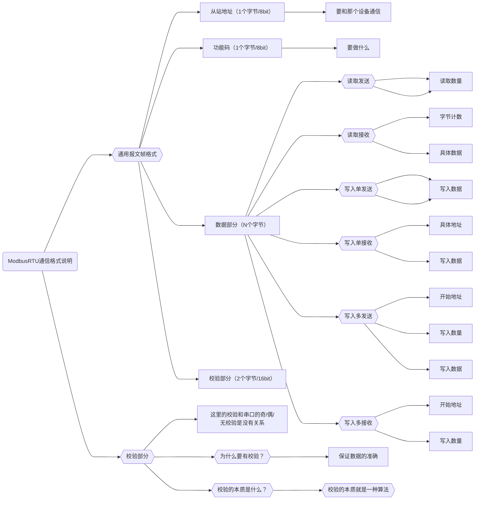

---
date:
  created: 2024-01-10
tags:
  - Modbus
authors: [Tenax]
description: >
  Learn the basics of the Modbus protocol and the analysis of ModbusRTU communication messages, as well as the development of communication libraries.
---

# 学习 Modbus 协议和 ModbusRTU 通信

<!-- more -->

## Modbus 协议基础知识

长地址模型

| 存储区名称 | 存储区代号 | 绝对地址范围  | 相对地址范围 |
| ---------- | ---------- | ------------- | ------------ |
| 输入线圈   | 1 区       | 100001~165536 | 0~65535      |
| 输出线圈   | 0 区       | 000001~065536 | 0~65535      |
| 输入寄存器 | 3 区       | 300001~365536 | 0~65535      |
| 保持寄存器 | 4 区       | 400001~465536 | 0~65535      |

短地址模型

| 存储区名称 | 存储区代号 | 绝对地址范围 | 相对地址范围 |
| ---------- | ---------- | ------------ | ------------ |
| 输入线圈   | 1 区       | 10001~19999  | 0~9998       |
| 输出线圈   | 0 区       | 00001~09999  | 0~9998       |
| 输入寄存器 | 3 区       | 30001~39999  | 0~9998       |
| 保持寄存器 | 4 区       | 40001~49999  | 0~9998       |

如果我们使用不了那么多的数据，可以使用短地址模型，否则，我们就使用长地址模型

??? question "什么是线圈？"

    前面介绍 Modbus 的内容中多次提到线圈（coil）和寄存器（register）的概念，尤其是 Modbus 功能码 中，操作的对象基本上都是线圈和寄存器。
    
    在 Modbus 协议中之所以仍然称为线圈和寄存器，完全是历史原因。在 PLC 应用领域，一个线圈就代表一个 PLC 输出点，也称为输出继电器。通过控制线圈导通与否来改变继电器输出状态，实现弱电控制强电。
    
    
    
    但实际上，在如今的 Modbus 设备中，它们都只是对应一块内存区域而已。其中，线圈代表位操作（bit），表示一个布尔变量；寄存器代表字操作（word），表示一个整型变量（当然也可以通过多个字的组合，表示浮点数以及其他复合数据结构）。在 Modbus 协议中，字（word）的长度是 16 位，即 2 个字节。

## 01H 功能码读取输出线圈（01 Coil Status/0x ）

{ width="1000" }

发送报文`01 01 00 0A 00 14 1C 07`  
`01`是从站地址，1 号站点  
`01`是功能码  
`00 0A`十六进制转换十进制是 10，即从 10 开始的 10  
`00 14`十六进制转换为十进制是 20，是 20 个线圈  
`1C 07`是 CRC 校验码

接收报文`01 01 03 03 00 00 CC 4E`  
`01`是从站地址，1 号站点  
`01`是功能码  
`03`是三个字节计数，因为 20 个线圈的值需要二十个位储存，一个字节是八位（八位寄存器），所以需要三个字节来储存  
`03 00 00`03 二进制为 0011，上图中从地址 10 开始两个 11，后面全部补 0 即`03 00 00`  
`CC 4E`是 CRC 校验码

## 02H 功能码读取输入线圈（02 Input Status/1x）

{ width="1000" }

发送报文`05 02 00 14 00 0A B9 8D`  
`05`是从站地址，1 号站点  
`02`是功能码  
`00 14`十六进制转换十进制是 20，即从 20 开始的 20  
`00 0A`十六进制转换为十进制是 10，是 10 个线圈  
`B9 8D`是 CRC 校验码

接收报文`05 02 02 03 00 48 88`  
`05`是从站地址，5 号站点  
`02`是功能码  
`02`是两个字节计数，因为 10 个线圈的值需要十个位储存，一个字节是八位（八位寄存器），所以需要两个字节来储存  
`03 00`03 二进制为 0011，上图中从地址 20 开始两个 11，后面全部补 0 即`03 00`  
`48 88`是 CRC 校验码

## 03H 功能码读取输出寄存器（03 Holding Register/4x）

{ width="1000" }

发送报文`02 03 00 0A 00 04 64 38`  
`02`是从站地址，2 号站点  
`03`是功能码  
`00 0A`十六进制转换十进制是 10，即从 10 开始的 10  
`00 04`十六进制转换为十进制是 4，是 4 个寄存器  
`64 38`是 CRC 校验码

接收报文`02 03 08 00 01 00 02 00 03 00 04 02 50`  
`02`是从站地址，2 号站点  
`03`是功能码  
`08`是八个计数，一个寄存器是十六个 bit，两个字节（十六位寄存器），所以四个寄存器需要 8 个字节来储存  
`00 01 00 02 00 03 00 04`是数据，`00 01`是数据 1，`00 02`是数据 2，`00 03`是数据 3，`00 04`是数据 4  
`02 50`是 CRC 校验码

## 04H 功能码读取输入寄存器（04 Input Registers/4x）

{ width="1000" }

发送报文`02 04 00 0A 00 04 DI F8`  
`02`是从站地址，2 号站点  
`04`是功能码  
`00 0A`十六进制转换十进制是 10，即从 10 开始的 10  
`00 04`十六进制转换为十进制是 4，是 4 个寄存器  
`DI F8`是 CRC 校验码

接收报文`02 04 08 00 01 00 02 00 03 00 04 B3 8A`  
`02`是从站地址，2 号站点  
`04`是功能码  
`08`是八个计数，一个寄存器是十六个 bit，两个字节（十六位寄存器），所以四个寄存器需要 8 个字节来储存  
`00 01 00 02 00 03 00 04`是数据，`00 01`是数据 1，`00 02`是数据 2，`00 03`是数据 3，`00 04`是数据 4  
`B3 8A`是 CRC 校验码

## 05H 功能码预置单线圈（01 Coil Status/0x ）

{ width="1000" }

发送报文`02 05 00 05 FF 00 9C 08`  
`02`是从站地址，2 号站点  
`05`是功能码  
`00 05`十六进制转换十进制是 5，即从 05 地址置位的 5  
`FF 00`是置位（**00 00 是复位，1 变 0**）  
`9C 08`是 CRC 校验码

接收报文相同

## 06H 功能码预置单寄存器（03 Holding Register/4x）

{ width="1000" }

发送报文`05 06 00 0A 00 7B E8 6F`  
`05`是从站地址，5 号站点  
`06`是功能码  
`00 0A`十六进制转换十进制是 10，即从 10 地址写入的 10  
`00 7B`是写入 123 的 123  
`E8 6F`是 CRC 校验码

接收报文相同

## 0FH 功能码预置多线圈（01 Coil Status/0x ）

{ width="1000" }

发送报文`01 0F 00 01 00 05 01 16 D3 58`  
`01`是从站地址，1 号站点  
`0F`是功能码  
`00 01`十六进制转换十进制是 1，即从 1 开始的 1  
`00 05`是数量即 5 个线圈  
`01 16`是一个字节，八位；16 是如图的 Ture 和 False 的占位，00010110，所以是 16  
`D3 58`是 CRC 校验码

接收报文`01 0F 00 01 00 05 C4 08`  
字节计数和数据去掉，其他相同  
`C4 08`是 CRC 校验码

{ width="1000" }

需要注意的是不会改变其他线圈的值

## 10H 功能码预置多寄存器（03 Holding Register/4x）

{ width="1000" }

发送报文`01 10 00 0A 00 05 0A 00 01 00 02 00 03 00 04 00 05 E0 60 `  
`01`是从站地址，1 号站点  
`10`是功能码  
`00 0A`十六进制转换十进制是 10，即从 10 开始的 10  
`00 05`是数量即 5 个寄存器  
`0A`五个寄存器是十个字节  
`00 01 00 02 00 03 00 04 00 05`是数据  
`E0 60`是 CRC 校验码

接受报文`01 10 00 0A 00 05 20 08 `  
字节计数和数据去掉，其他相同  
`E0 60`是 CRC 校验码

字节计数，如上图的 0A 最大限制是 FF 即 255，所以长度最多是 127

??? question "为什么字节计数最多是 255，长度是 127？"

    1.  **字节计数最大值为 255**：
        由于字节计数字段只有 1 个字节，其最大值为 255。因此，数据部分最多可以有 255 个字节。
    2.  **寄存器数量最大值是 127**：
        由于每个寄存器占 2 个字节，所以要传送 127 个寄存器数据，总共需要 127×2 = 254 字节。为了将这个数据合适地封装在报文中，字节计数限制为 255 字节，而寄存器的数量限制为 127（因为要保证字节计数的有效性）。
    
    因此，理论上最多可以写 127 个寄存器（每个寄存器 2 字节），这时数据部分的字节数为 254 字节，加上字节计数 1 字节，总报文长度为 255 字节。

## 大小端

在 **Modbus协议** 中，**大小端（Endianness）** 是指多字节数据的存储顺序问题。对于单个寄存器（16位）而言，**不存在大小端问题**，因为一个寄存器本身只能存储 2 个字节（16 位），其内部字节顺序由 Modbus 协议本身决定。但当涉及**多个寄存器组成的多字节数据**（如 32 位整数、浮点数等）时，大小端问题就会变得非常重要。

------

### **1. 什么是大小端？**

- **大端模式（Big-Endian）**：高位字节存储在低地址（或寄存器的前一个字节）。
- **小端模式（Little-Endian）**：低位字节存储在低地址（或寄存器的前一个字节）。

例如，一个 32 位整数 `0x12345678` 的存储方式：

- **大端**：`0x12 0x34 0x56 0x78`（高位在前）
- **小端**：`0x78 0x56 0x34 0x12`（低位在前）

------

### **2. 为什么单个寄存器不存在大小端问题？**

- **一个 Modbus 寄存器是 16 位（2 字节）**，其内部字节顺序由 Modbus 协议固定为 **大端模式**：
  - 例如，数值 `0x1234` 在寄存器中存储为 `0x12`（高字节）和 `0x34`（低字节）。
  - **直接读取单个寄存器的值时，它的字节顺序是固定的，没有歧义**，因此不存在大小端问题。

------

### **3. 多寄存器数据的大小端问题**

当需要读取**多个寄存器组成的数据**（如 32 位整数、浮点数）时，需考虑两种顺序：

1. **字节顺序（Byte Order）**：每个寄存器内部的字节顺序。
2. **字顺序（Word Order）**：多个寄存器的排列顺序。

例如，一个 32 位整数 `0x12345678` 占用两个寄存器，可能有以下存储方式：

| 数据格式 | 寄存器1  | 寄存器2  | 实际字节流            |
| :------- | :------- | :------- | :-------------------- |
| **ABCD** | `0x1234` | `0x5678` | `0x12 0x34 0x56 0x78` |
| **BADC** | `0x3412` | `0x7856` | `0x34 0x12 0x78 0x56` |
| **CDAB** | `0x5678` | `0x1234` | `0x56 0x78 0x12 0x34` |

- **ABCD**：大端字节序 + 大端字序（最常见）。
- **BADC**：小端字节序 + 大端字序。
- **CDAB**：大端字节序 + 小端字序。

------

### **4. 为什么需要关心大小端？**

如果设备与 Modbus 主站的数据格式不一致，会导致解析错误。例如：

- 设备发送 `0x12345678`（ABCD 格式），但主站按 BADC 解析，会得到错误值 `0x34127856`。

------

### **5. 实际应用示例**

假设从寄存器 `40001` 读取一个 32 位浮点数：

- **原始寄存器值**：`40001=0x4148`, `40002=0x0000`（对应浮点数 `12.5`）。
- **解析方式**：
  - **ABCD 格式**：`0x41 0x48 0x00 0x00` → 正确值 `12.5`。
  - **BADC 格式**：`0x48 0x41 0x00 0x00` → 错误值 `6.3e-05`。

------

**总结**

- **单个寄存器（16 位）**：没有大小端问题，直接按大端解析。
- **多寄存器（32 位及以上）**：必须明确设备的数据格式（如 ABCD、BADC 等），否则会导致解析错误。

实际开发中，需参考设备文档或通过实验确定数据格式。3:55:11

---

**参考：**

[C#上位机开发零基础入门到精通](https://www.bilibili.com/video/BV1CUmKYnEW2)

[Modbus 寄存器](https://www.modbus.cn/27930.html)
