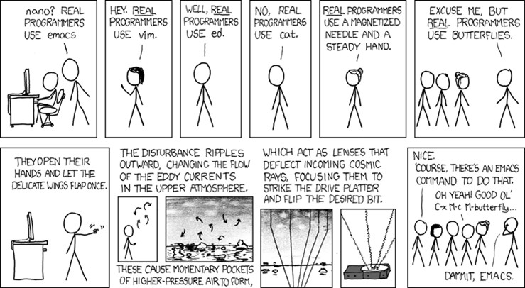
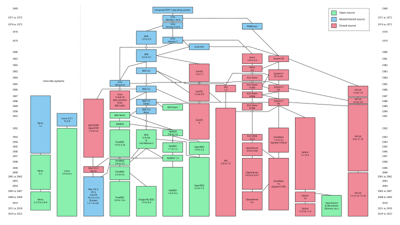

---
date:
  created: 2024-03-05
tags:
  - Linux
authors: [Tenax]
description: >
  来自 UCB 的一门讲解 Linux 的入门课程，比起定位相同的 MIT 的公开课 Missing Semester，Decal 讲解得更加系统、也更加清晰。Decal非常适合零基础的同学来学习。
---

# Linux SysAdmin DeCal

来自 UCB 的一门讲解 Linux 的入门课程，比起定位相同的 MIT 的公开课 Missing Semester，Decal 讲解得更加系统、也更加清晰，这也是我推荐它的主要原因。比起 Missing Semester 更像是给已经开始编程但没有系统使用过这些工具的学生的查缺补漏，DeCal 更像是面向零基础的同学的课程。一共十二周的课程内容，包括 Linux 基础、shell 编程（还有 tmux 、vim）、包管理、服务(Services)、基础计算机网络、网络服务、安全(密钥管理)、Git、Docker、Kubernetes、Puppet 和 CUDA。 十分适合新手了解和入门 Linux 环境相关内容。

美中不足的是部分课程作业需要在远程服务器操作，比如关于 ssh 的练习，需要 UCB 内部账号访问。但是大部分作业可以通过自己搭建的虚拟机 + 使用 Xshell 等工具或者直接使用 Linux 桌面版来操作练习，在听完完整课程和做完作业后，相信已经对 Linux 有最基本的了解了。

为弥补无法使用远程服务器的不足以及熟悉 linux 命令行的需求，在此推荐 [bandit](https://overthewire.org/wargames/bandit/) 。bandit 是一款来自 OverTheWire 网站的 Wargame，为 CTF 爱好者提供免费的练习靶场。bandit 的前 15 个 level 都是基础的 linux 操作而不涉及任何 CTF 知识。这些练习也正好弥补了 DeCal 外校无法访问的部分（主要是远程链接、文件权限）等内容。

# Bandit

## Level 0

The goal of this level is for you to log into the game using SSH. The host to which you need to connect is **bandit.labs.overthewire.org**, on port 2220. The username is **bandit0** and the password is **bandit0**. Once logged in, go to the [Level 1](https://overthewire.org/wargames/bandit/bandit1.html) page to find out how to beat Level 1.【此级别的目标是让您使用 SSH 登录游戏。 您需要连接的主机是 **bandit.labs.overthewire.org**，在端口 2220 上。用户名是 **bandit0**，密码是 **bandit0**。登录后，转到 [Level 1](https://overthewire.org/wargames/bandit/bandit1.html) 页面以了解如何通过 Level 1。】

```bash
ssh bandit0@bandit.labs.overthewire.org -p 2220
```

## Level 0 → Level 1

The password for the next level is stored in a file called **readme** located in the home directory. Use this password to log into bandit1 using SSH. Whenever you find a password for a level, use SSH (on port 2220) to log into that level and continue the game.【下一级的密码存储在名为 **自述文件**位于 HOME 目录中。使用此密码通过 SSH 登录 bandit1。每当您找到某个关卡的密码时，请使用 SSH（在端口 2220 上）登录该关卡并继续游戏。】

通过题目描述我们知道`readme`文件在桌面上直接 list

```bash
ls
```

出现`readme`文件，直接读取

```bash
cat readme
```

Congratulations on your first steps into the bandit game!!
Please make sure you have read the rules at https://overthewire.org/rules/
If you are following a course, workshop, walkthrough or other educational activity,
please inform the instructor about the rules as well and encourage them to
contribute to the OverTheWire community so we can keep these games free!

The password you are looking for is: ZjLjTmM6FvvyRnrb2rfNWOZOTa6ip5If

timed out waiting for input: auto-logout
Connection to bandit.labs.overthewire.org closed.

【恭喜您迈出了强盗游戏的第一步！
请确保您已阅读 https://overthewire.org/rules/ 上的规则。
如果您正在参加课程、研讨会、演练或其他教育活动、
也请告知讲师相关规则，并鼓励他们并鼓励他们为 OverTheWire 社区做出贡献，这样我们才能保持这些游戏的免费性！
您正在寻找的密码是 ZjLjTmM6FvvyRnrb2rfNWOZOTa6ip5If

等待输入超时：自动注销
与 bandit.labs.overthewire.org 的连接已关闭。】

## Level 1 → Level 2

The password for the next level is stored in a file called **-** located in the home directory【下一级的密码存储在名为 **-** 位于主目录中】

<u>`./-`，这样可以避免 `file` 命令把 `-` 误解为选项标志。</u>

```bash
cat ./-
```

263JGJPfgU6LtdEvgfWU1XP5yac29mFx

## Level 2 → Level 3

The password for the next level is stored in a file called **spaces in this filename** located in the home directory【下一级的密码存储在主目录中名为 **spaces 的文件中**】

```bash
ls
```

文件名叫`spaces in this filename`

```bash
cat 'spaces in this filename'
```

MNk8KNH3Usiio41PRUEoDFPqfxLPlSmx

## Level 3 → Level 4

The password for the next level is stored in a hidden file in the **inhere** directory.【下一级的密码存储在 **inhere** 目录中。】

```bash
ls
```

发现`inhere`目录

```bash
cd inhere
```

进入`inhere`后 list 发现没有文件显示

```bash
ls -A  #-A， --几乎全部，请勿列出隐含的 .和。。
```

发现`...Hiding-From-You`文件

```bash
cat ...Hiding-From-You
```

2WmrDFRmJIq3IPxneAaMGhap0pFhF3NJ

## Level 4 → Level 5

The password for the next level is stored in the only human-readable file in the **inhere** directory. Tip: if your terminal is messed up, try the “reset” command.【下一级的密码存储在 **inhere** 目录中唯一可读的文件中。提示： 如果您的终端搞砸了，请尝试 “reset” 命令。】

直接进入`inhere`目录，list 输出`-file00  -file01  -file02  -file03  -file04  -file05  -file06  -file07  -file08  -file09`

```bash
file ./*  #查看所有文件的类型
```

`./-file00: data
./-file01: data
./-file02: data
./-file03: data
./-file04: data
./-file05: data
./-file06: data
./-file07: ASCII text
./-file08: data
./-file09: data`

可以发现只有`-file07`可以 cat

```bash
cat ./-file07
```

4oQYVPkxZOOEOO5pTW81FB8j8lxXGUQw

## Level 5 → Level 6

The password for the next level is stored in a file somewhere under the **inhere** directory and has all of the following properties:【下一级的密码存储在 **inhere** 目录下某个位置的文件中，并具有以下所有属性：】

- human-readable【人类可读】
- 1033 bytes in size【大小为 1033 字节】
- not executable【不可执行】

这关我的思路是`du ./*/* -b`查看所有文件的大小

`1039    ./maybehere00/-file1
9388    ./maybehere00/-file2
7378    ./maybehere00/-file3
6118    ./maybehere00/spaces file1
6850    ./maybehere00/spaces file2
1915    ./maybehere00/spaces file3
6028    ./maybehere01/-file1
288     ./maybehere01/-file2
9641    ./maybehere01/-file3
4139    ./maybehere01/spaces file1
4543    ./maybehere01/spaces file2
8834    ./maybehere01/spaces file3
3801    ./maybehere02/-file1
3511    ./maybehere02/-file2
4932    ./maybehere02/-file3
6746    ./maybehere02/spaces file1
8488    ./maybehere02/spaces file2
2275    ./maybehere02/spaces file3
315     ./maybehere03/-file1
6595    ./maybehere03/-file2
8275    ./maybehere03/-file3
2190    ./maybehere03/spaces file1
3385    ./maybehere03/spaces file2
9234    ./maybehere03/spaces file3
4410    ./maybehere04/-file1
2619    ./maybehere04/-file2
2117    ./maybehere04/-file3
5532    ./maybehere04/spaces file1
2491    ./maybehere04/spaces file2
6002    ./maybehere04/spaces file3
2346    ./maybehere05/-file1
5959    ./maybehere05/-file2
2572    ./maybehere05/-file3
880     ./maybehere05/spaces file1
2420    ./maybehere05/spaces file2
8585    ./maybehere05/spaces file3
5731    ./maybehere06/-file1
1076    ./maybehere06/-file2
3443    ./maybehere06/-file3
4073    ./maybehere06/spaces file1
4251    ./maybehere06/spaces file2
8065    ./maybehere06/spaces file3
3663    ./maybehere07/-file1
2488    ./maybehere07/-file2
3362    ./maybehere07/-file3
4130    ./maybehere07/spaces file1
9064    ./maybehere07/spaces file2
1022    ./maybehere07/spaces file3
1077    ./maybehere08/-file1
3825    ./maybehere08/-file2
2650    ./maybehere08/-file3
215     ./maybehere08/spaces file1
3693    ./maybehere08/spaces file2
9138    ./maybehere08/spaces file3
3628    ./maybehere09/-file1
774     ./maybehere09/-file2
7961    ./maybehere09/-file3
5301    ./maybehere09/spaces file1
8716    ./maybehere09/spaces file2
7569    ./maybehere09/spaces file3
1052    ./maybehere10/-file1
1991    ./maybehere10/-file2
1237    ./maybehere10/-file3
8269    ./maybehere10/spaces file1
3570    ./maybehere10/spaces file2
2155    ./maybehere10/spaces file3
1211    ./maybehere11/-file1
4559    ./maybehere11/-file2
8854    ./maybehere11/-file3
3147    ./maybehere11/spaces file1
503     ./maybehere11/spaces file2
8845    ./maybehere11/spaces file3
9678    ./maybehere12/-file1
251     ./maybehere12/-file2
9076    ./maybehere12/-file3
2157    ./maybehere12/spaces file1
2460    ./maybehere12/spaces file2
1639    ./maybehere12/spaces file3
1359    ./maybehere13/-file1
1423    ./maybehere13/-file2
3014    ./maybehere13/-file3
3952    ./maybehere13/spaces file1
952     ./maybehere13/spaces file2
4389    ./maybehere13/spaces file3
4282    ./maybehere14/-file1
8351    ./maybehere14/-file2
3756    ./maybehere14/-file3
1382    ./maybehere14/spaces file1
871     ./maybehere14/spaces file2
376     ./maybehere14/spaces file3
8794    ./maybehere15/-file1
9499    ./maybehere15/-file2
6299    ./maybehere15/-file3
1623    ./maybehere15/spaces file1
51      ./maybehere15/spaces file2
1637    ./maybehere15/spaces file3
4277    ./maybehere16/-file1
5301    ./maybehere16/-file2
8085    ./maybehere16/-file3
9773    ./maybehere16/spaces file1
3146    ./maybehere16/spaces file2
7509    ./maybehere16/spaces file3
1133    ./maybehere17/-file1
1791    ./maybehere17/-file2
4422    ./maybehere17/-file3
8361    ./maybehere17/spaces file1
3387    ./maybehere17/spaces file2
6381    ./maybehere17/spaces file3
9697    ./maybehere18/-file1
77      ./maybehere18/-file2
2306    ./maybehere18/-file3
7334    ./maybehere18/spaces file1
6348    ./maybehere18/spaces file2
7040    ./maybehere18/spaces file3
6302    ./maybehere19/-file1
5594    ./maybehere19/-file2
7965    ./maybehere19/-file3
7186    ./maybehere19/spaces file1
8785    ./maybehere19/spaces file2
2307    ./maybehere19/spaces file3`

发现并没有字节大小为 1033 的，为什么呢？

**`*` 通配符会匹配文件名中 没有 点号（`.`）开头的文件。例如，`ls *` 会列出所有文件和文件夹，但 不会显示隐藏文件（即以 `.` 开头的文件），这是因为 `*` 默认不匹配以 `.` 开头的文件。**

如果你想包括以 `.` 开头的隐藏文件，可以使用 `.\*`。例如，`ls .*` 会列出当前目录下所有隐藏文件和目录。

如果你想同时匹配普通文件和隐藏文件，可以使用 `.*` 和 `*` 一起：`ls * .*`。

```bash
find . -type f -size 1033c -not -executable -exec file {} + | grep ASCII #.：仅搜索当前工作目录;-type f:仅搜索当前工作目录;-size 1033c 查找大小正好为 1033 字节的文件（Find 使用“c”表示字节）;-not -executable 仅查找非可执行文件
```

`find`命令输出./maybehere07/.file2: ASCII text, with very long lines (1000)

**-exec file {} +**对 find 返回的所有结果执行 `file` 命令

**注意 ：** {} 是一个占位符，表示 find 找到的文件的名称将被替换的位置。“+”号用来批量将多个匹配的文件传递给 `file` 命令

```bash
cat ./maybehere07/.file2
```

HWasnPhtq9AVKe0dmk45nxy20cvUa6EG

## Level 6 → Level 7

The password for the next level is stored **somewhere on the server** and has all of the following properties:【下一级的密码存储在**服务器上的某个位置，**并具有以下所有属性：】

- owned by user bandit7【归用户 Bandit7 所有】
- owned by group bandit6【归 Group Bandit6 所有】
- 33 bytes in size【大小为 33 字节】

```bash
find / -type f -user bandit7 -group bandit6 -size 33c  #/：搜索整个服务器（/ 是 Linux 上的根目录，类似于 Windows 上的 C：/ Drive）;-type: f 仅搜索文件;-user bandit7:搜索用户bandit7拥有的文件;-group bandit6:搜索属于bandit6组的文件;-size 33c:查找大小正好为33字节的文件
```

`find: ‘/drifter/drifter14_src/axTLS’: Permission denied
find: ‘/root’: Permission denied
find: ‘/snap’: Permission denied
find: ‘/tmp’: Permission denied
find: ‘/proc/tty/driver’: Permission denied
find: ‘/proc/3024060/task/3024060/fdinfo/6’: No such file or directory
find: ‘/proc/3024060/fdinfo/5’: No such file or directory
find: ‘/home/bandit31-git’: Permission denied
find: ‘/home/ubuntu’: Permission denied
find: ‘/home/bandit5/inhere’: Permission denied
find: ‘/home/bandit30-git’: Permission denied
find: ‘/home/drifter8/chroot’: Permission denied
find: ‘/home/drifter6/data’: Permission denied
find: ‘/home/bandit29-git’: Permission denied
find: ‘/home/bandit28-git’: Permission denied
find: ‘/home/bandit27-git’: Permission denied
find: ‘/lost+found’: Permission denied
find: ‘/etc/polkit-1/rules.d’: Permission denied
find: ‘/etc/multipath’: Permission denied
find: ‘/etc/stunnel’: Permission denied
find: ‘/etc/xinetd.d’: Permission denied
find: ‘/etc/credstore.encrypted’: Permission denied
find: ‘/etc/ssl/private’: Permission denied
find: ‘/etc/sudoers.d’: Permission denied
find: ‘/etc/credstore’: Permission denied
find: ‘/dev/shm’: Permission denied
find: ‘/dev/mqueue’: Permission denied
find: ‘/var/log/amazon’: Permission denied
find: ‘/var/log/unattended-upgrades’: Permission denied
find: ‘/var/log/chrony’: Permission denied
find: ‘/var/log/private’: Permission denied
find: ‘/var/tmp’: Permission denied
find: ‘/var/spool/cron/crontabs’: Permission denied
find: ‘/var/spool/bandit24’: Permission denied
find: ‘/var/spool/rsyslog’: Permission denied
find: ‘/var/cache/ldconfig’: Permission denied
find: ‘/var/cache/apt/archives/partial’: Permission denied
find: ‘/var/cache/pollinate’: Permission denied
find: ‘/var/cache/private’: Permission denied
find: ‘/var/cache/apparmor/2425d902.0’: Permission denied
find: ‘/var/cache/apparmor/baad73a1.0’: Permission denied
find: ‘/var/lib/polkit-1’: Permission denied
find: ‘/var/lib/amazon’: Permission denied
/var/lib/dpkg/info/bandit7.password
find: ‘/var/lib/apt/lists/partial’: Permission denied
find: ‘/var/lib/chrony’: Permission denied
find: ‘/var/lib/snapd/void’: Permission denied
find: ‘/var/lib/snapd/cookie’: Permission denied
find: ‘/var/lib/private’: Permission denied
find: ‘/var/lib/ubuntu-advantage/apt-esm/var/lib/apt/lists/partial’: Permission denied
find: ‘/var/lib/update-notifier/package-data-downloads/partial’: Permission denied
find: ‘/var/lib/udisks2’: Permission denied
find: ‘/var/crash’: Permission denied
find: ‘/boot/efi’: Permission denied
find: ‘/boot/lost+found’: Permission denied
find: ‘/sys/kernel/tracing’: Permission denied
find: ‘/sys/kernel/debug’: Permission denied
find: ‘/sys/fs/pstore’: Permission denied
find: ‘/sys/fs/bpf’: Permission denied
find: ‘/run/lock/lvm’: Permission denied
find: ‘/run/systemd/inaccessible/dir’: Permission denied
find: ‘/run/systemd/propagate/systemd-udevd.service’: Permission denied
find: ‘/run/systemd/propagate/systemd-resolved.service’: Permission denied
find: ‘/run/systemd/propagate/systemd-networkd.service’: Permission denied
find: ‘/run/systemd/propagate/irqbalance.service’: Permission denied
find: ‘/run/systemd/propagate/systemd-logind.service’: Permission denied
find: ‘/run/systemd/propagate/chrony.service’: Permission denied
find: ‘/run/systemd/propagate/polkit.service’: Permission denied
find: ‘/run/systemd/propagate/ModemManager.service’: Permission denied
find: ‘/run/systemd/propagate/fwupd.service’: Permission denied
find: ‘/run/lvm’: Permission denied
find: ‘/run/cryptsetup’: Permission denied
find: ‘/run/multipath’: Permission denied
find: ‘/run/screen/S-bandit20’: Permission denied
find: ‘/run/sudo’: Permission denied
find: ‘/run/user/11008’: Permission denied
find: ‘/run/user/11005’: Permission denied
find: ‘/run/user/11006/systemd/inaccessible/dir’: Permission denied
find: ‘/run/user/11016’: Permission denied
find: ‘/run/user/11012’: Permission denied
find: ‘/run/user/11004’: Permission denied
find: ‘/run/user/11000’: Permission denied
find: ‘/run/user/11024’: Permission denied
find: ‘/run/user/11022’: Permission denied
find: ‘/run/user/11003’: Permission denied
find: ‘/run/user/11001’: Permission denied
find: ‘/run/user/11002’: Permission denied
find: ‘/run/user/11023’: Permission denied
find: ‘/run/user/11011’: Permission denied
find: ‘/run/user/11014’: Permission denied
find: ‘/run/user/11020’: Permission denied
find: ‘/run/user/11013’: Permission denied
find: ‘/run/user/11007’: Permission denied
find: ‘/run/user/11029’: Permission denied
find: ‘/run/user/11025’: Permission denied
find: ‘/run/user/11032’: Permission denied
find: ‘/run/user/11019’: Permission denied
find: ‘/run/user/11031’: Permission denied
find: ‘/run/user/11021’: Permission denied
find: ‘/run/user/11015’: Permission denied
find: ‘/run/user/11009’: Permission denied
find: ‘/run/user/11026’: Permission denied
find: ‘/run/user/11017’: Permission denied
find: ‘/run/chrony’: Permission denied
find: ‘/run/udisks2’: Permission denied`

仔细看是找到了，这一堆没有访问权限里`/var/lib/dpkg/info/bandit7.password`

```bash
find / -type f -user bandit7 -group bandit6 -size 33c 2> /dev/null
```

/var/lib/dpkg/info/bandit7.password

**`2> /dev/null`**

这个部分的作用是将错误输出（即 `stderr`）重定向到 `/dev/null`，这是一个特殊的设备文件，任何写入它的数据都会被丢弃。使用这个重定向后，所有的错误消息（例如 `Permission denied` 或 `No such file or directory`）都会被忽略，不会显示出来。

```bash
cat /var/lib/dpkg/info/bandit7.password
```

morbNTDkSW6jIlUc0ymOdMaLnOlFVAaj

## Level 7 → Level 8

The password for the next level is stored in the file **data.txt** next to the word **millionth**【下一级的密码存储在文件**data.txt** 在单词 **millionth** 旁边】

```bash
grep '^millionth' data.txt
```

dfwvzFQi4mU0wfNbFOe9RoWskMLg7eEc

## Level 8 → Level 9

The password for the next level is stored in the file **data.txt** and is the only line of text that occurs only once【下一级的密码存储在文件**data.txt** 并且是唯一只出现一次的文本行】

```bash
cat data.txt | sort | uniq -u
```

4CKMh1JI91bUIZZPXDqGanal4xvAg0JM

## Level 9 → Level 10

The password for the next level is stored in the file **data.txt** in one of the few human-readable strings, preceded by several ‘=’ characters.【下一级的密码存储在文件**data.txt** 在为数不多的人类可读字符串之一中，前面有几个 '=' 字符。】

```bash
cat data.txt | strings
```

h!]v
r>)1
v0i)b
B:PyZ
#0/u
dyaE
F#X[
7$'0'T
^^^K
Y5}|
9g_$
^h#%EG
Fq/
/OZ[4'
D#?P
POl%
}========== the
db*Nz
cc5M
`oaT
E:zr0
!S:%_
yG@q-
-c5N
xHp\
wS>n
^B~9
Q!vw
'5jl
. \,
66exg
h^Ad
,`Cd80
UB;N
U@j?
p\l=
te24
UNvlE
U%^6
JB]H:|v
|M '
{QMrWv
8:% XD
H"hU
/uP\_
(mhY
+6,hH
4vjm4
q09B
^8NSs
2>X)
Y>v4
lKUO
U>QkM:,V
imZ?L

> ^?X
> ;c<Q=.dEXU!
> j!ZL
> jX09
> 5bBK
> 4Rl*7gH
> F 4Cq
> #61QW
> hqI.X
> 3JprD========== passwordi
> 7`4(WG
& `T
> \_eOdY
> G>Wu}
> o|)s
> z_b^
> HCg\@0
> z8N*-Z`
v7\y
s>|5
!$L&
Qm1U
JH|)
qi{|p
Yy6]
BWu7
qC(=
"t<2-u
i)W5
Czmnf&v
TO"'
~fDV3========== is
R<+{
)DtZ
)>tgdu
FvkY
Z)w,
|:H5
I;j@
0V[1
d_hnA;
oH`w
> 7=oc
> _N]d
> 3>\kGG
> drfx
> }UQB
> uP6{
> hu%lLj
> F>x!&
> [^?_
> M<ls%
> "kz8I
> zP=
> 6o+u
> piUv
> a*xX$
>%!~D
>xfvO
>Oq.g
>(p^A
>-45c
>^w#K
>FP&!
>ba+D
>n.i3m
>GMKB
>#s}t
>K>]`c
>sn)>
>v8jB
>"x|L
>}ZIg
>r~rB
>+_38
>Z@bj:
>~de=
>.sjd
>  qT\
>T`q
>Ylyg<
>t1QAk
>@99F
>oxGz$W~"
> 9+`1
_$>S
J]epm
pfT8
I`8l
> fL'~\_
> a Z
> DT[N
> z9wo
> 5Gfy
> "}@>bn
> O(k$N
>zw[@
>!a5^
>9Z8]
>sqEAj
>D)A'r
>an      g
>'3pp(
>s(-Qv
>3k=fQ
>usTR
>Nyz3wI
>+)&_i
>WDp8
>u"o~
>p(67
>WZ+(
>?o&g
>k        `
>~o=0
>6+$N
> :'3z
> uJw&
> &kIIJ
> b4glu
> ]NJR
> %uW
> |r_s
> zVw-
> Q$QBW
> Q{h%w
> 69}=
> ?uPsH
> @WG|
> %"=Y
> Pew%J
> &3[2
> *u;(%P
> dA`d
|>,p
oY%\
3W`j
> D+io?
> =tZ~07
> ^6Og
> Tx+X
> rs2J
> -M8<
> Dq^B
> Qv"Y
> fk)B
> g+;Y
> Uum
> D9========== FGUW5ilLVJrxX9kMYMmlN4MgbpfMiqey
> u1Ebi
> &x(>G
> .`EQ
w>}x
D%(f
1#4!9
:79(
m!}B
| Zd
qQ>Gu
!6D(
J?,2
IEO*
uu>@    ;
KrQ!
$V8a
{vl0pup
AWwyxY
j(ue
X<'j
<HR]/
7!`tcT7
> Gp(2
> FoOvx
> hF|W
> 3edvE%
> _#@k
> N=~[!N
> -VSe
> a0XJ
> 3;8_
> zA=?0j
> b}M>s
> %Xi-
> Qobt
> 6Cjk
> H`U ^
> +v J
> 4(clh~U
> #R^g
> Xgz|
> )oRj

FGUW5ilLVJrxX9kMYMmlN4MgbpfMiqey

## [Shell Demo](https://www.bilibili.com/video/BV1gj421Q7Jk/)

```bash
neofetch
```

查看运行的系统，是一个需要安装的软件

```bash
# ls  # cd  # ls -a  # vim :wq  # cat  # htop  # man htop
```



**Editors**

- Nano
- Vim(`vimtutor`)
- Emacs(Emacs Tutorial)
- (NotePad)

Try running `(editor of choice)(file)`{not  notepad }

**Shell Commands**

- Basic structure of a command is 

`[command][flags][arguments]`

- RTFM!`man(command)`
- Google is also your best friend.

**Common Shell Commands**

- `cd` - change directory
- `ls` - list directory
- `cat` - concatenate and print files
- `head` - read the first 10 lines
- `less` - read larger files
- `mv` - move
- `cp` - copy
- `rm` - delete a file

[**Beginner Lab 1 - Unix, the Shell, OSS**](https://decal.ocf.berkeley.edu/archives/2021-fall/labs/b1/)

`.tgz` 文件实际上是两种文件格式的组合。有时，您会将这些文件视为 `.tar.gz`。

不过，除非你要求，`否则 tar` 本身不会压缩文件。这就是 `gzip`（或 `bzip2`）的用武之地。`gzip` 会压缩你的文件，所以 tar + gzip 经常连用。它看起来像这样： `file --(tar)--> file.tar --(gzip)--> file.tar.gz`.

如果你足够仔细地阅读 `tar` 文档，你会发现你也可以给命令一个使用 `gzip` 压缩文件的选项，总共为你节省一行 shell 命令！

```bash
tar xvzf b01.tgz #tar：调用 tar 命令（用于打包/解压 .tar 文件）;x：extract（解压文件）;v：verbose（显示解压过程的详细信息）;z：gzip（处理 .gz 压缩文件）;f：file（指定要处理的文件）
```

```bash
pwd
```

`pwd` 命令显示当前目录路径，它是**实时查询**的。

```bash
grep -B 2 "http" big_data.txt
```

```bash
chmod +x a_script
```


## [UNIX](https://www.bilibili.com/video/BV1Ry421B7Js)

## Evolution of UNIX



**OSS Licenses:Legal Jiggery-Pokery**

- Copyleft(GPL)

   - "I want to make sure that all versions of GNU remain free." - Stallman(GNU Manifesto)

   - "a cancer that attaches itself in an intellectual property sense to everything it touches" - Steve Ballmer

- Permissive(MIT，BSD，Apache，WTFPL)

   - Do whatever you want(basically)

- [choosealicense.com/licenses]()


---

**参考:**

[Sysadmin DeCal](https://csdiy.wiki/%E7%BC%96%E7%A8%8B%E5%85%A5%E9%97%A8/DeCal/?h=linux)
