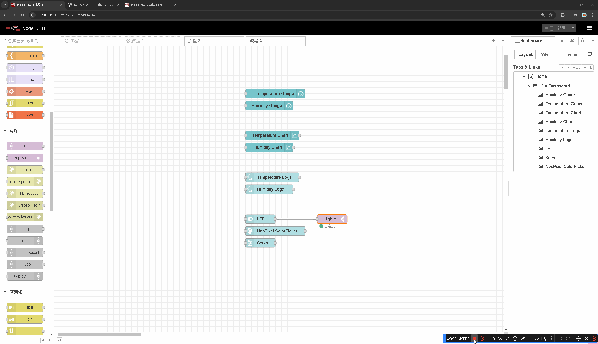
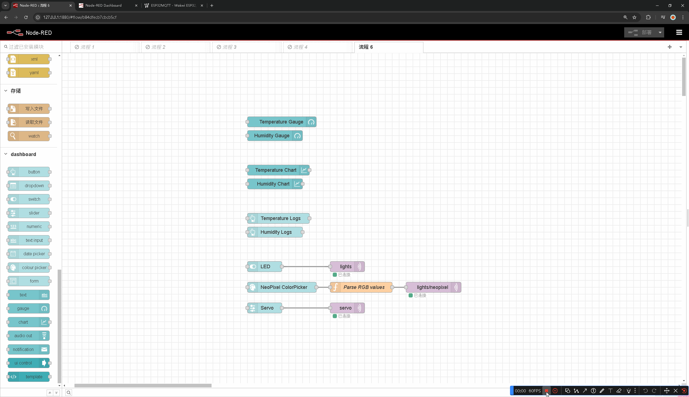
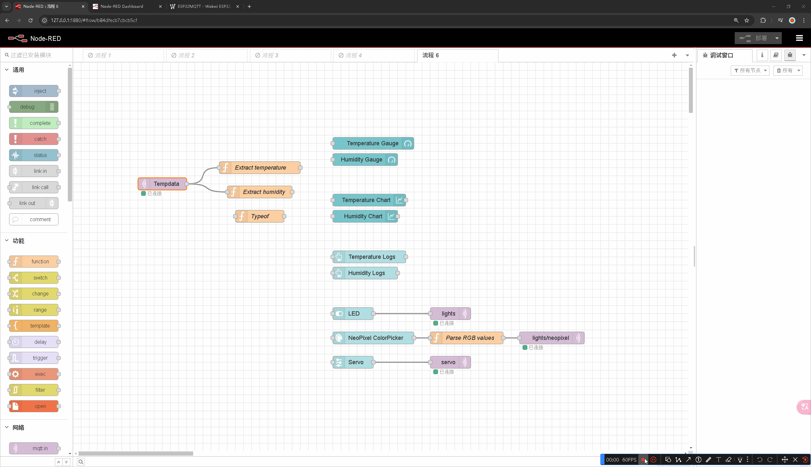

---
date:
  created: 2024-12-21
tags:
  - Node-RED
authors: [Tenax]
description: >
  Welcome to our blog on MQTT in  NodeRED, where we will explore the powerful combination of MQTT and Node-RED to create an interactive MQTT dashboard. With MQTT being a popular messaging protocol for IoT applications, and Node-RED providing a visual programming interface, we will uncover the seamless integration of ESP32 and Node-RED to build a robust and user-friendly MQTT dashboard.
---

# 学习 Node-RED 中的 MQTT 和构建 MQTT 控制面板

<!-- more -->

## 安装`node-red-dash`插件

```shell
npm i node-red-dashboard
```

安装稳定版本

```shell
npm i node-red/node-red-dashboard
```

从 GitHub 获取的最新版本

---

## 配置 dashboard


这里我们分别添加了两个`gauge` `chart` `button`节点，点开`gauge`节点只需要配置 Group 和 Label 项


我们没有 group 节点，需要添加新的 group


点击进入添加 group 会发现，我们还没有 tab 节点，我们需要添加一个新的 tab 节点


tab 节点配置如上，点击添加完成 tab 节点配置


group 节点配置如上，点击添加完成 group 节点配置


到这里我们就知道可以完成了一个`gauge`节点的配置


我们照猫画虎只配置节点中的 Group 选项和 Label 选项，依此配置好`gauge` `chart` `button`节点，三组分别命名为`Temperature Gauge` `Humidity Gauge`、`Temperature Chart` `Humidity Chart`和`Temperature Logs` `Humidity Logs`


控制面板界面通过 http://localhost:1880/ui 访问，配置好后如上图所示，


这里我添加`switch` `colour` `picker slider`节点并按照之前的只配置 Group 选项和 Label 选项


特别需要注意的只有`slider`节点的 Range 选项需要特别配置


可以看到新配置的三个节点在 Dashboard 上出现


点击右上角选项栏，点击显示，会发现有个 Dashboard 选项


点击后 Dashboard 选项后右边侧边栏会出现如图所示的节点


我们将最后一个`Temperature Gauge`节点拖至`Humidity Gauge`节点下方


我们在控制面板界面发现本来下面的 Temperature Gauge 仪表，移动至 Humidity Gauge 仪表下方了

### 详细配置 dashboard 中的节点


这里我们修改了`gauge`节点中的 Group 项和 Label 项，需要特别注意的只有 Units 和 Range 项，如上图所示


这里我们修改了`gauge`节点中的 Group 项和 Label 项，需要特别注意的只有 Range 项，如上图所示


这里我们只修改了`switch`节点中的 Group 项和 Label 项，需要特别注意的只有 On payload 和 Off Payload 项，如上图所示


这里我们只修改了`colour picker`节点中的 Group 项和 Label 项，需要特别注意的只有 Format 项，如上图所示


这是修改后的变化

---

## Node-RED 中的 MQTT

### 配置 mqtt broker


添加一个`mqtt out`节点，我们发现节点报错，我们需要配置我们服务端


点击`mqtt out`节点，添加新的 mgtt-broker 配置


这里我们需要使用到[HiveMQ 的公共 Broker](https://www.hivemq.com/mqtt/public-mqtt-broker/)


配置 mgtt-broker，这里我只配置了服务端一项，别的没做修改


配置`mqtt out`节点，配置如上图所示


可以看到已经成功连接上 HiveMQ 的公共 Broker

### 点灯


这是一个[在 wokwi 上创建的项目](https://wokwi.com/projects/349943659510104658)，用于展示我们的 Node-RED 成果




我们依法炮制出新的两个`mqtt out`节点像上面的用来点亮 LED 的`mqtt out`节点一样，只需配置好服务端、主题和 QoS 即可，特别需要注意的是主题项，连接`NeoPixel ColorPicker`节点的`mqtt out`节点主题项为 lights/neopixel，连接`Servo`节点的`mqtt out`节点主题项为 servo

### LED 显色

**这里我们有个问题**

`colour picker`节点即我们上图的`NeoPixel ColorPicker`节点输出的值并不符合要求

```c
  else if (String(topic) == "lights/neopixel") {
    int red, green, blue;
    sscanf(data.c_str(), "%d,%d,%d", &red, &green, &blue); // Parse the received data into RGB values
    Serial.print("Setting NeoPixel color to (R,G,B): ");
    Serial.print(red);
    Serial.print(",");
    Serial.print(green);
    Serial.print(",");
    Serial.println(blue);
    fill_solid(leds, NUM_LEDS, CRGB(red, green, blue)); // Set all LEDs in the strip to the specified color
    FastLED.show(); // Update the LED strip with the new color
     fill_solid(leds, NUM_LEDS, CRGB(red, green, blue));
     FastLED.show();
  }
```

这是我们 wokwi 示例中用来接收 node-red 传来的值并在单片机上给 LED 显示颜色的一串代码，可以看出我们需要接收的格式是`"%d,%d,%d"`


当我们调色盘选中颜色后，上面标的两个值分别为`NeoPixel ColorPicker`节点输出的，后者需要我们处理后符合我们要求的值


```js
msg.payload = msg.payload.replace("rgb(", "").replace(")", "");
return msg;
```

我们添加一个函数节点`Parse RGB values`来处理`NeoPixel ColorPicker`节点传来的数值



我们可以看到能正常展示颜色

### 在控制面板上显示温度和湿度


我们添加一个`mqtt in`节点并配置好服务端、主题和 QoS 选项，用一个`debug`节点连接，在调试窗口中输出，可以看到我们 wokwi 示例中传来的温度和湿度


我们使用两个函数来处理和提取我们 wokwi 示例中传来的温度和湿度

```js title="Extract temperature 节点"
var input = msg.payload; // Assuming the input is in msg.payload

// Remove any leading or trailing whitespace
input = input.trim();

// Split the input string using commas as the delimiter
var values = input.split(",");

// Remove leading and trailing whitespace from each value and convert to float
values = values.map(function (value) {
  return parseFloat(value.trim());
});

msg.payload = values[0]; // Set the output payload to the array of float values
return msg;
```

```js title="Extract humidity 节点"
var input = msg.payload; // Assuming the input is in msg.payload

// Remove any leading or trailing whitespace
input = input.trim();

// Split the input string using commas as the delimiter
var values = input.split(",");

// Remove leading and trailing whitespace from each value and convert to float
values = values.map(function (value) {
  return parseFloat(value.trim());
});

msg.payload = values[1]; // Set the output payload to the array of float values
return msg;
```

**仔细看图，我们会发现右边的调试窗口报错了**

```shell
function : (error)

"TypeError: input.trim is not a function"
```

这是为什么呢？原因很简单，**因为 wokwi 示例中传来的温度和湿度不是字符串类型，是 number 类型，调用不了 trim()这个方法**


我们可以添加一个函数节点取名为`Typeof`来判断传来的温度和湿度是什么类型的数据，图中我们可以看到的是 number 类型

**回顾一下之前的步骤我们会发现，当我们用`debug`节点调试的时候，输出的内容显示是 string 类型，字符串类型，我猜测是`debug`节点内部处理后转换成了字符串类型，导致类型发生了转换**


处理方法也很简单，我们只需要把`mqtt in`节点即`Tempdata`节点中的输出项改为字符串，就能把传来的数据转换为 number 类型。<u>当然你也可以在处理函数中添加代码，转换成字符串类型</u>。



将`Extract temperature`节点连接至`Temperature Gauge`和`Temperature Chart`节点，将`Extract humidity`节点连接至`Humidity Gauge`和`Humidity Chart`节点，就可以在 控制面板上正常显示

---

**参考：**

[MQTT in Nodered | Building MQTT Dashboard](https://highvoltages.co/iot-internet-of-things/mqtt/mqtt-in-nodered-and-mqtt-dashboard/)

[https://flows.nodered.org/node/node-red-dashboard](https://flows.nodered.org/node/node-red-dashboard)
